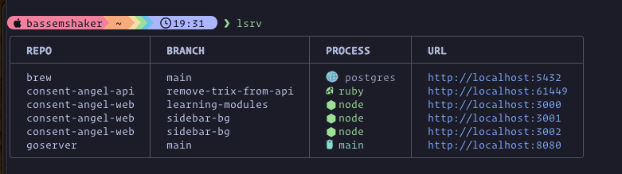

# lsrv - List your local running servers

A lightweight Go CLI tool to list all running servers across your repos and worktrees.



## Installation

### Option 1: Build from source

```bash
# Clone the repository
git clone https://github.com/bassemshaker/lsrv.git
cd lsrv

# Build the binary
go build -o lsrv

# Move to your PATH (optional)
sudo mv lsrv /usr/local/bin/
```

### Option 2: Install with go install

```bash
go install github.com/bassemshaker/lsrv@latest
```

## Usage

Run from anywhere:

```bash
lsrv
```

Show help:

```bash
lsrv --help
```

## Output

lsrv displays a beautiful color-coded table showing:

- **REPO**: Repository name (from git remote or directory name)
- **BRANCH**: Current git branch
- **PROCESS**: The process running the server
- **URL**: HTTP URL to access the server

## How It Works

1. Uses `lsof` to find **all** processes listening on TCP ports
2. Filters by common development server port ranges (ports >= 3000)
3. Checks if the process is running in a git repository
4. Detects the programming language/framework from:
   - Process name (ruby, node, python, etc.)
   - Project files (go.mod, package.json, Cargo.toml, etc.)
5. Displays results in a color-coded, sorted table with icons

**Smart Detection:**

- Detects **any** server process (not limited to specific languages)
- Works with compiled binaries (Go, Rust executables) by checking for project files
- Shows servers with icons for recognized languages

## Requirements

- macOS or Linux
- Go 1.16+ (for building from source)
- `lsof` command (pre-installed on macOS)
- Git repositories for branch detection

# License

MIT License - see [LICENSE](LICENSE) file for details.
